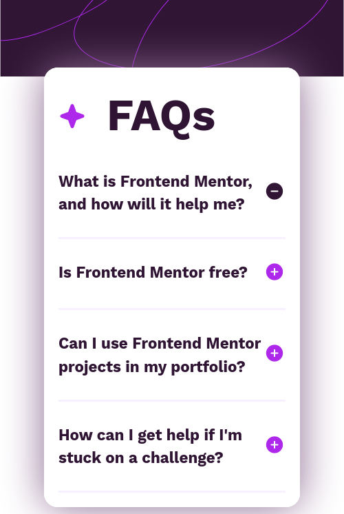
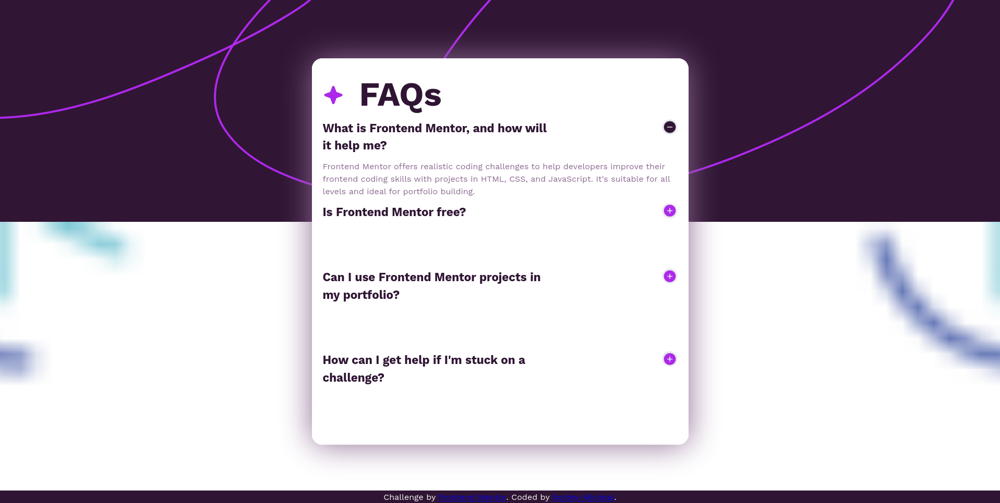

# Frontend Mentor - FAQ accordion solution

This is a solution to the [FAQ accordion challenge on Frontend Mentor](https://www.frontendmentor.io/challenges/faq-accordion-wyfFdeBwBz). Frontend Mentor challenges help you improve your coding skills by building realistic projects. 

## Table of contents

- [Overview](#overview)
  - [The challenge](#the-challenge)
  - [Screenshot](#screenshot)
  - [Links](#links)
- [My process](#my-process)
  - [Built with](#built-with)
  - [What I learned](#what-i-learned)
  - [Continued development](#continued-development)
  - [Useful resources](#useful-resources)
- [Author](#author)


## Overview

### The challenge

Users should be able to:

- Hide/Show the answer to a question when the question is clicked
- View the optimal layout for the interface depending on their device's screen size
- See hover and focus states for all interactive elements on the page

### Screenshot





### Links

- Solution URL: (https://github.com/Nortey-Micheal/faq-acccordion/)
- Live Site URL: (https://nortey-micheal.github.io/faq-acccordion/)

## My process

### Built with

- Semantic HTML5 markup
- CSS custom properties
- Flexbox


### What I learned

How to combine two background images.
Using an image as a background image is better than embedding the image.

```css
body {
  background-image: url(assets/images/background-pattern-desktop.svg),url(assets/images/favicon-32x32.png);
  background-position: top , bottom;
  background-size: contain;
  background-repeat: no-repeat,repeat;
}
```

### Continued development

CSS styling the backgrounds


### Useful resources

- [Example resource 1](https://www.w3schools.com/css/css_background_shorthand.asp) - This helped me to apply and adjust the background images.


## Author


- Frontend Mentor - [@Nortey-Micheal](https://www.frontendmentor.io/profile/Nortey-Micheal)

